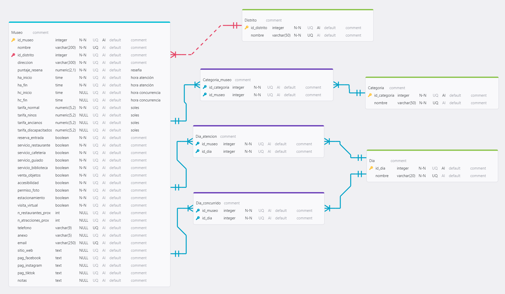
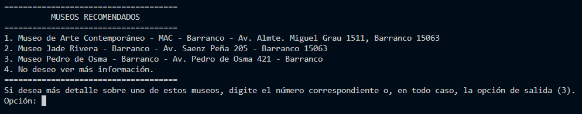
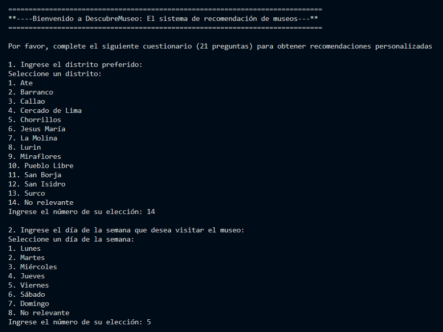

# DescubreMuseo

DescubreMuseo es un sistema experto diseñado para ayudar a los usuarios a elegir qué museo visitar en función de sus intereses específicos (arte, historia, etc.), precios de entrada, horarios de menor concurrencia, y otros criterios relevantes. Este sistema ofrece recomendaciones personalizadas basadas en una base de conocimientos que integra datos sobre museos y patrones de visitas.

## Base de conocimiento
Es dinámica y cuenta tanto con los datos de los museos como las reglas necesarias para su análisis. El esquema de la base de datos asociada es el siguiente:

## Ejemplos de ejecución
### Ejemplo 1

### Ejemplo 2

### Ejemplo 3

### Ejemplo 4

### Ejemplo 5

